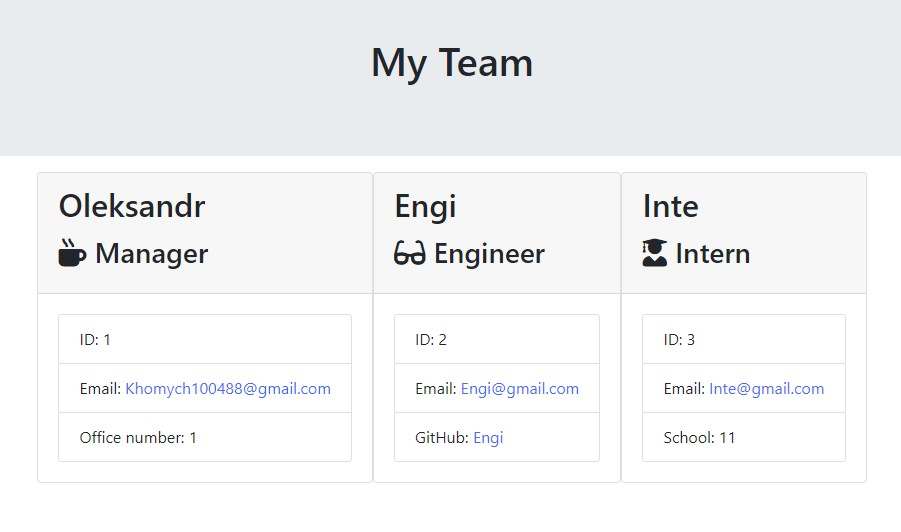
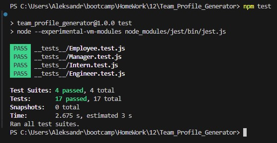

# Team Profile Generator

[](https://opensource.org/licenses/MIT)



test report


## Description
Node.js command line application. This application will collect information about the employees of a software development team and then create an HTML web page that displays summary data for each person. every piece of code passes every test provided.

## Usage
```
required for use

download source code
use npm i
run the application in the terminal with the command node index.js
to run the test - npm test

```

## Credits

To create the application, I used resources on:
[MDN Web Docs](https://developer.mozilla.org)
||
[GitHub Docs](https://docs.github.com)
||
[W3Schools](https://www.w3schools.com/)
||
[Node.js](https://www.npmjs.com/package/node)
||
[Jest](https://www.npmjs.com/package/jest)
||
[Inquirer](https://www.npmjs.com/package/inquirer)
